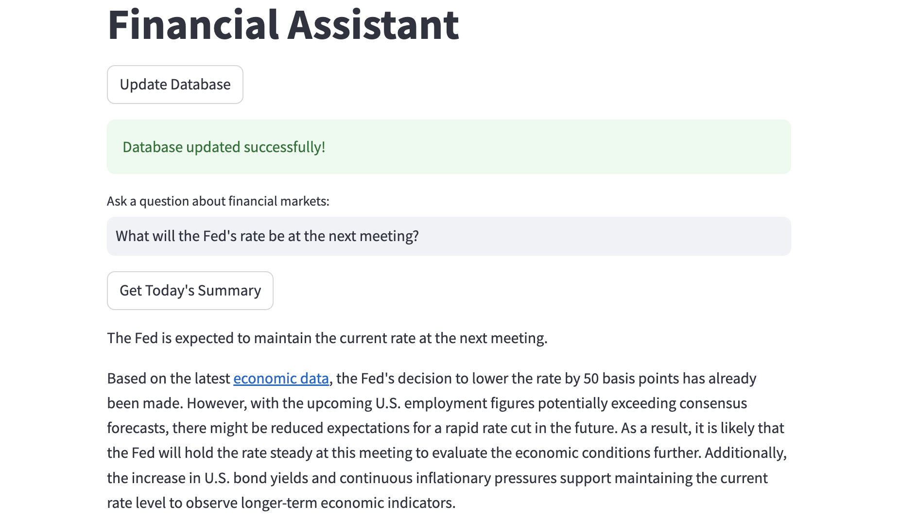

# Financial-Assistant
Financial Assistant is an advanced project designed to provide insightful financial and economic advice using the power of GPT-4o, RAG (Retrieval-Augmented Generation) based on FAISS, and integration with the Telegram API.

This tool is capable of downloading financial news from Telegram channels and using this information to answer questions and offer investment advice, taking into account the current global economic situation.

## Project Structure

```
Financial-Assistant/
├── app/
│   ├── __init__.py
│   ├── main.py                     # Main script starting project
│   ├── telegram_client.py          # Telegram session created
│   ├── rag_system.py               # RAG-system based on FAISS
│   └── gpt_client.py               # Custom LLM used by post
├── images/                         # Images for project
├── data/                           
│   ├── faiss_index.idx
│   └── telegram_messages.json      # Custom database by JSON
├── README.md
└── requirements.txt
```

## How to start

For code starting you have to get API-keys of GPTunnel service and Telegram API. Then add the names of telegram channels in a variable `TELEGRAM_CHANNEL_USERNAME=@channel_1,@channel_2,...`

Install dependences using `pip`
```
pip install -r requirements.txt
```

Or by `poetry`
```
cat requirements.txt | xargs poetry add
```

Launch your environment and run the `streamlit`
```
streamlit run app/main.py
```

## Features

- Intelligent Q&A: Leverages GPT-4o to provide accurate and insightful answers to financial and economic questions.
- Investment Advice: Offers strategic advice on investments, considering the latest developments in the global market.
- News Integration: Connects to Telegram API to fetch the latest financial news from various channels.
- Source Referencing: Provides links to news articles and sources that form the basis of its advice and answers, ensuring transparency and reliability.

## Example

Below is an example of how the Financial Assistant works:

